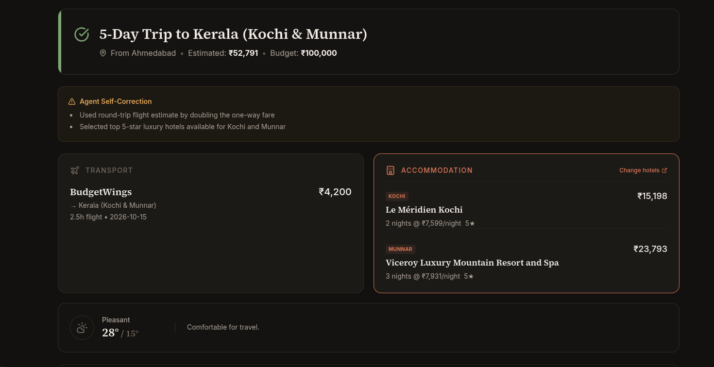
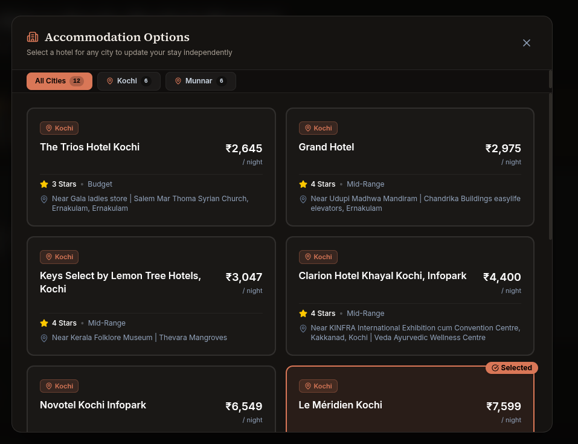
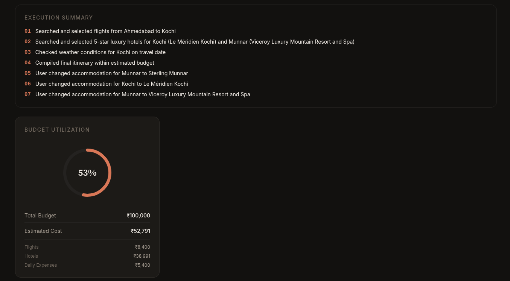
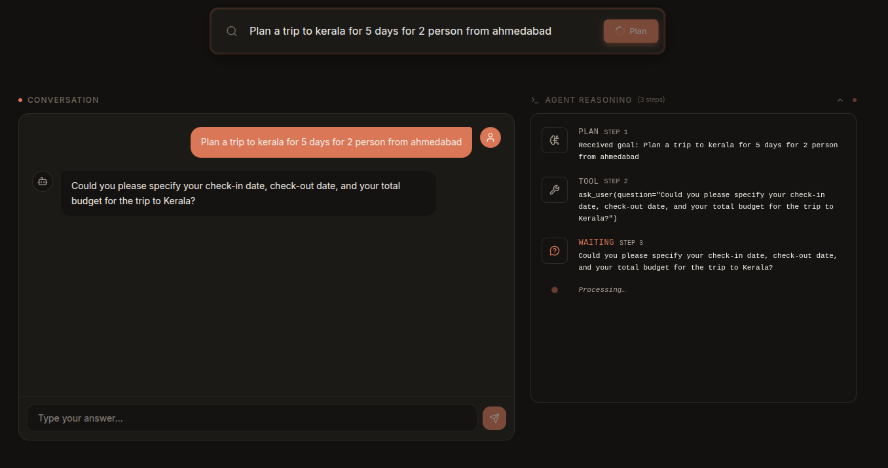
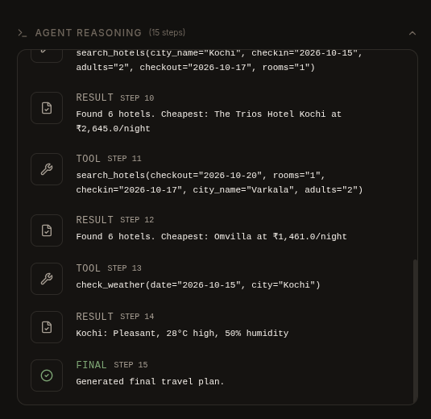

## About Intuz

This library is maintained by [Intuz](https://www.intuz.com), an AI-first software development company specializing in [Agentic AI Development](https://www.intuz.com/ai)
and [Custom AI Development](https://www.intuz.com/custom-ai-development).
<br><br>

INTUZ is presenting a multi-step AI travel planning agent and web application.

---

# Tripcraft

> An AI-powered travel planning application that autonomously generates optimized itineraries.

## Use Cases

### 1. Autonomous Travel Planning
- **Problem:** Users spend hours researching flights, hotels, and activities, often struggling to stay within budget.
- **Solution:** An intelligent agent that simultaneously evaluates flight and hotel options to build a complete itinerary.
- **Outcome:** A comprehensive, budget-conscious travel plan generated in seconds.

### 2. Multi-step Reasoning with Self-Correction
- **Problem:** Standard LLMs fail when initial choices (like flights) consume too much of the budget, leaving nothing for hotels.
- **Solution:** The agent maintains state across multiple steps, recognizes budget violations, and autonomously retries with cheaper options.
- **Outcome:** Highly reliable and robust planning that adapts to constraints dynamically.

### 3. Integrated Tool Usage
- **Problem:** LLMs lack access to real-time, real-world data like current flight prices or hotel availability.
- **Solution:** The system connects the LLM to specialized tools (flight scraper, hotel scraper) to fetch live data.
- **Outcome:** Itineraries grounded in real data rather than hallucinated estimates.

---

## Description

Tripcraft is a multi-step AI planning agent with a modern web interface. It uses a Large Language Model with native function calling to autonomously plan travel.

This application enables users to:
- Input a desired destination, travel dates, and budget.
- Receive a complete travel plan including flights and hotel accommodations.
- Benefit from an agent that self-corrects and optimizes choices when budget limits are exceeded.

Built with FastAPI and Next.js, the system provides a seamless and robust AI-driven planning experience.

---

## Features

| Feature | Description |
|---------|-------------|
| Autonomous Planning | Multi-step agent loop for comprehensive itinerary generation |
| State Management | Tracks budget assumptions across multiple turns |
| Self-Correction | Automatically retries with cheaper options if budget is exceeded |
| Configurable | Environment-based configuration via `.env` |
| Modular | Clean separation of concerns |
| Tested | Includes basic test suite |

---

## Architecture

```text
User Goal
   |
Next.js Frontend
   |
FastAPI Backend (/api/plan)
   |
Agent Loop -------+ Tool Registry
   |  ^           |      |
   |  |           |      v
   |  +-----------+ Tools (flights, hotels, etc.)
   v                     |
LLM <--------------------+
   |
   v
Final JSON Plan
```

---

## Project Structure

```text
tripcraft/
|-- backend/
|   |-- app/
|   |   |-- agent/       # Core agent loop and state management
|   |   |-- tools/       # Tools for flights, hotels, etc.
|   |   `-- main.py      # FastAPI entry point
|   |-- pyproject.toml
|   `-- run.py
|-- frontend/
|   |-- src/             # Next.js UI components and pages
|   |-- package.json
|   `-- next.config.ts
|-- Screenshots/
|   `-- logo.jpg
|-- setup.sh
`-- README.md
```

---

## Screenshots

<div align="center">
  
  
  
  
  
</div>

---

## Getting Started

### Prerequisites
- Python 3.10+
- Node.js & npm
- API key from a supported LLM provider (e.g., OpenRouter, NVIDIA NIM)
- uv (Python dependency manager)

### Quick Setup (Recommended)

```bash
git clone <repository-url>
cd Tripcraft

# One-command setup
chmod +x setup.sh
./setup.sh
```

### Manual Setup

```bash
git clone <repository-url>
cd Tripcraft

# Create virtual environment and install backend dependencies
cd backend
uv sync

# Configure backend environment
cp .env.example .env
# Edit .env with your API keys
cd ..

# Install frontend dependencies
cd frontend
npm install
```

### Running the Application

```bash
# Start Backend
cd backend
uv run uvicorn app.main:app --reload

# Start Frontend (in a new terminal)
cd frontend
npm run dev
```

Available at: `http://localhost:3000`

---

## Configuration

| Variable | Required | Default | Description |
|----------|----------|---------|-------------|
| `OPENROUTER_API_KEY` | Yes (or NVIDIA) | -- | API key for OpenRouter LLM provider |
| `NVIDIA_API_KEY` | Yes (or OpenRouter) | -- | API key for NVIDIA NIM LLM provider |
| `MAX_AGENT_ITERATIONS` | No | `15` | Maximum number of reasoning loops the agent can perform |
| `DEFAULT_ORIGIN` | No | `Ahmedabad` | Default origin city for flight search |
| `API_BEARER_TOKEN` | No | `tripcraft-dev-token` | Token required to access the backend API |
| `HOST` | No | `0.0.0.0` | Host address for the backend server |
| `PORT` | No | `8000` | Port for the backend server |

---

## Usage

1. Start the backend and frontend servers as described above.
2. Open the UI at `http://localhost:3000`.
3. Provide your desired destination, travel dates, and budget.
4. View the generated travel itinerary and agent execution logs as they are streamed to the frontend.

### API Endpoints (if applicable)

| Method | Endpoint | Description |
|--------|----------|-------------|
| `POST` | `/api/plan` | Starts the travel planning agent and streams Server-Sent Events (SSE) for real-time progress |

---

## Dependencies

| Package | Purpose |
|---------|---------|
| FastAPI | Backend web framework |
| Next.js | Frontend React framework |
| langchain-core | Framework for LLM agent integration |
| python-dotenv | Environment variable management |

---

## Testing

```bash
cd backend
uv run pytest app/tests/ -v
```

---

<h1>License</h1>

Copyright (c) 2026 Intuz Solutions Pvt Ltd.
<br><br>
Permission is hereby granted, free of charge, to any person obtaining a copy of this software and associated documentation files (the "Software"), to deal in the Software without restriction, including without limitation the rights to use, copy, modify, merge, publish, distribute, sublicense, and/or sell copies of the Software, and to permit persons to whom the Software is furnished to do so, subject to the following conditions:
<br><br>
THE SOFTWARE IS PROVIDED "AS IS", WITHOUT WARRANTY OF ANY KIND, EXPRESS OR IMPLIED, INCLUDING BUT NOT LIMITED TO THE WARRANTIES OF MERCHANTABILITY, FITNESS FOR A PARTICULAR PURPOSE AND NONINFRINGEMENT. IN NO EVENT SHALL THE AUTHORS OR COPYRIGHT HOLDERS BE LIABLE FOR ANY CLAIM, DAMAGES OR OTHER LIABILITY, WHETHER IN AN ACTION OF CONTRACT, TORT OR OTHERWISE, ARISING FROM, OUT OF OR IN CONNECTION WITH THE SOFTWARE OR THE USE OR OTHER DEALINGS IN THE SOFTWARE.

<h1></h1>
<a href="http://www.intuz.com">

</a>
